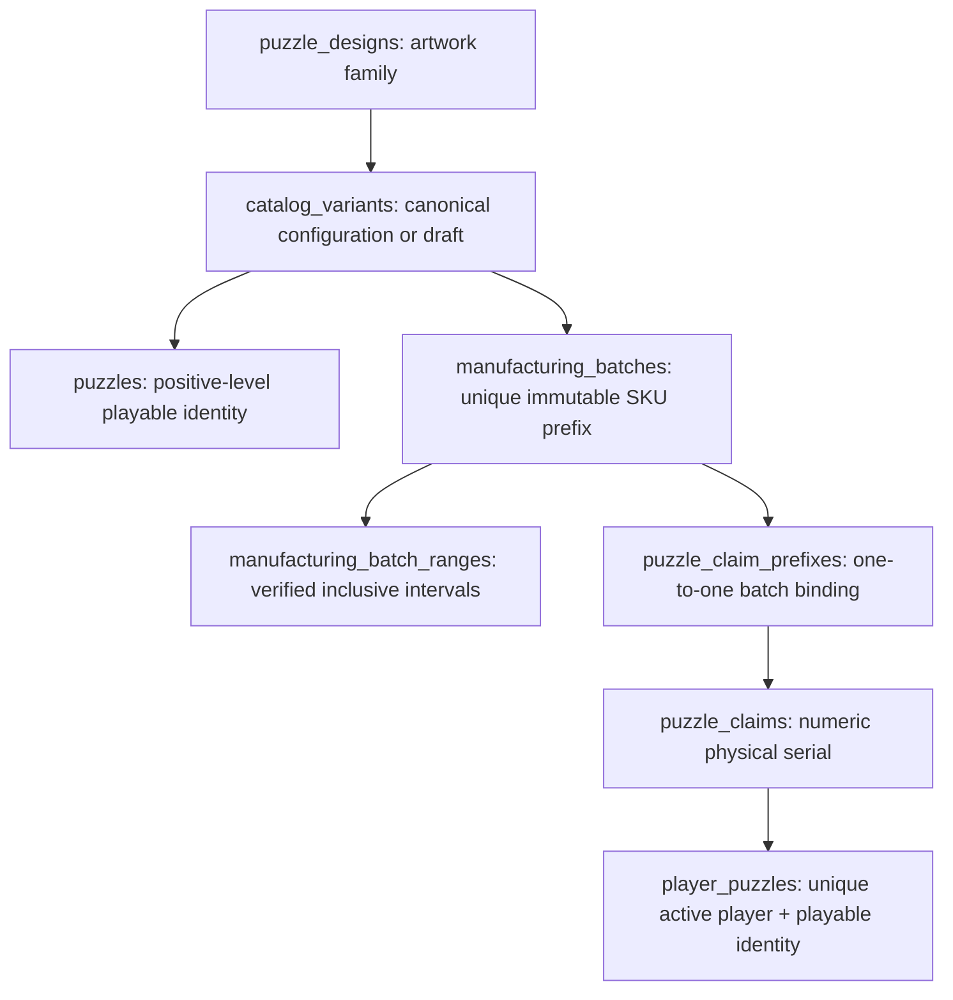

# CircZles catalog and manufacturing rollout

This branch changes catalog management and physical claims. It does not deploy, run a live migration, import into production, modify production environment variables or change player identity/progression data.

## Persistent model

The additive migration is `backend/drizzle/0023_circzles_catalog_manufacturing.sql`, with `meta/0023_snapshot.json` and the appended journal entry. Migrations 0000–0022 are unchanged. No existing table is altered, dropped or emptied. The migration generically backfills catalog variants from existing playable records while preserving their exact `puzzle_id` and design IDs. It deliberately creates no manufactured ranges from legacy prefixes.

| New table | Fields and protection |
| --- | --- |
| `catalog_variants` | UUID; design FK; nullable unique playable FK; display name; brand; CIRCZLES/ACCESSORY; size; pieces; nullable positive decimal level; image; description; marketing JSON; DRAFT/ACTIVE/ARCHIVED; timestamps. Active CircZles require a playable ID and non-null positive level. Accessories have no playable ID. |
| `manufacturing_batches` | UUID; catalog FK; nullable playable FK; nullable unique claim-prefix FK; brand/type; number identifier; run; globally unique SKU prefix across all statuses; original first full SKU; bigint start/end/quantity; status; import key (unique); source fingerprint; raw source JSON; timestamps; variant index. Positive ordered bounds and quantity; active CircZles require playable/prefix links; accessories have neither. |
| `manufacturing_batch_ranges` | UUID; batch FK; positive bigint inclusive bounds; creation time; unique batch/start/end index. No physical-unit rows are pre-created. Overlaps are rejected under a batch row lock. |

New foreign keys use RESTRICT. Existing claims retain their existing prefix ID: the batch's unique prefix FK provides an immutable one-to-one manufacturing trace without rewriting claims. Claim events also include `manufacturingBatchId`. The active `(player_id,puzzle_id)` ownership uniqueness stays intact, including across different batches.

## Authorization and admin workflow

Only existing active `SUPER_ADMIN` accounts receive `CATALOG_MANAGE`; REVIEWER receives none. Each management API checks the hashed, unexpired, unrevoked server session and active user/admin role. Production requires the existing trusted website proxy. Mutations reject mismatched Origin and cross-site browser requests. All management responses use `private, no-store`. Browser flags, query strings and role headers grant no authority.

`/admin/puzzles` is the CircZles Catalog. Its access check is a display gate; every API separately authorizes the request. The gate closes and rechecks when the session generation changes. Other production admin UI areas remain closed. The catalog supports paginated name/SKU search, status/type filters, metadata editing, new design/variant creation, explicit existing-design selection, adding batches to a chosen canonical variant, safe unclaimed corrections, activation/archival, additional verified ranges, claimed/remaining counts and import reconciliation.

The operator-only bootstrap is `backend/src/cli/provisionCatalogAdmin.ts`. It is never called at startup or exposed through HTTP. Through an approved operator connection, run it with `--user-id <existing verified active user UUID>` to preview; add `--apply` only after confirming that specific account should have SUPER_ADMIN authority. It requires a privately supplied `DATABASE_URL`, rejects missing/unverified/inactive users and does not create players or accounts. This role also includes the existing review/configuration permissions. No identity is automatically provisioned by this branch.

## Claims and history

`POST /api/puzzles/claim` still accepts only `{ "code": "CC-29-R2-01-0001" }`. The server derives the player from the session. Parsing uses the final hyphen-delimited segment; decimal levels stay in the prefix. Positive serial identity is PostgreSQL bigint, up to 9223372036854775807; leading zeroes are presentation only, with no four-digit limit. The code length limit is 200 characters.

A transaction locks the resolved batch, requires ACTIVE batch and canonical playable configuration, rejects accessories, validates membership in an actual manufactured interval, locks the player/canonical ownership key, checks the physical claim and ownership rules, then writes claim + ownership + `puzzle.added` event atomically. Existing unique constraints remain a final concurrency guard. A second physical unit for an already owned canonical CircZles is rejected without consuming it. Another player can claim that unit.

Additional disjoint intervals may start anywhere above zero; gaps remain unmanufactured even inside the batch's aggregate bounds. Appending a range does not change any old interval. Prefix/run/number/canonical/range corrections are blocked after claims; create a new batch or safely archive instead. Display metadata can still change. Gameplay fields are protected once a complete playable variant has manufacturing records: a different size/configuration needs a separate variant. Incomplete drafts can be completed, have their unclaimed NA setup explicitly corrected and then published.

Metadata updates mirror onto the existing playable record and send a commit-bound invalidation through the existing PostgreSQL/SSE channel to owners. The collection and Hub reload their owned catalog resource from canonical player-state changes. Successful claims also immediately insert the returned CircZles in the collection, invalidate older reads and refresh `/api/me` through the existing Zustand store. A failed hydration never retries an already committed claim.

An accessory remains catalog/manufacturing data only. A draft without a level has no playable row; an incomplete or archived playable row is not accepted by the existing submission/leaderboard checks. Existing reward and competition policies are preserved; import does not invent XP/SP rewards or enable competitions for new variants.

## Source import and reconciliation

`source.tsv` and `r1-r2-r3.source.json` preserve the supplied 78 rows and 11,373 units, including SKU formatting, decimal levels, identifiers, runs, sizes, original name spelling/case/trailing spaces, trailing brand spaces and `03`/`05` quantities. Canonical display names trim cosmetic whitespace; imported brand fields remain exact. Raw source values remain in the fixture and each batch's `sourceData`, and `firstFullSku` preserves the manufacturing reference. No piece counts were supplied, so none are invented. The supplied table has no NA or accessory rows; those are tested using clearly separate synthetic fixtures.

The manifest intentionally ships with empty `mappings`. Resolve every row explicitly using exactly one of `{ "catalogVariantId": "existing UUID" }` or `{ "newVariantKey": "explicit key" }`. Existing legacy prefixes must target their existing canonical variant, and the verified range must include every historical claim. A unique inactive/soft-deleted legacy prefix may be reactivated only through that explicit verified ACTIVE batch; its original prefix ID and claims are retained. Multiple historical registry records for one prefix block import for reconciliation instead of choosing one arbitrarily. A shared new key explicitly chooses one canonical variant; conflicting sizes, levels, brands, product types or provided piece counts reject that mapping. Display names never create a match. `mapping.example.json` demonstrates the Lion R2/R3 mapping only; it is not a completed production decision file.

Name similarity appears only as a reconciliation hint. Review `reconciliation.md`, including spelling ambiguities. The generic importer requires deliberate decisions even for new rows, preventing accidental creation of duplicates alongside an existing production catalog.

Load the completed manifest in the secured catalog UI. Dry-run calls `/api/admin/catalog/import/preview` and performs only reads/advisory locking, returning errors, counts and repeated-name review hints. Apply calls `/api/admin/catalog/import/apply`, revalidates under the catalog management lock and applies all rows in one transaction. A stable dataset+source-row key and SHA-256 source/mapping fingerprint make reruns skip unchanged imports; changed source/mapping is rejected for explicit correction. Concurrent admin/import work shares an advisory lock. A failed insert rolls back the entire apply. Players, IDs, accounts, sessions, wallets, XP/SP, claims, submissions, leaderboards and inventory are not changed by import.

## Manual production order

1. Review this branch and source reconciliation; prepare a complete explicit mapping manifest against the current canonical catalog and verify manufactured ranges, including historical claims. Take the normal database backup and validate the migration in staging.
2. Arrange the claim cutover so legacy claims are not reopened before ranges are verified. Existing ownership/history remains readable. Apply only the new migration through the migration ledger after 0022; **never run the old launch-reset operation**.
3. Deploy the reviewed backend and frontend together through the normal release process. The existing proxy/session/SSE configuration is reused; this branch does not modify production configuration. Catalog access remains closed without an active provisioned role.
4. Have an authorized operator preview and provision a verified account using the bootstrap above. Sign in through the normal native flow and verify that ordinary players and reviewers receive 401/403 on catalog APIs.
5. In the catalog, preview the reconciled source manifest, resolve every error and apply once. Preview/rerun must then show zero planned rows. Do not infer ranges for any remaining legacy prefix; register it explicitly with its existing canonical ID and verified historical coverage.
6. Validate first/last/outside-range claims, leading-zero duplicates, Lion cross-batch ownership, a name edit and live collection/stat refresh in staging before reopening claims. Existing owners, submissions and leaderboard IDs must be unchanged. Rewards for new canonical variants require an approved competition configuration, independent of manufacturing activation.

No step above was run against a live database by this task. Future R4/R5 batches use the same secured UI/API and need no code deployment.

## Validation

Final command results and the exact changed-file inventory are recorded in `validation.md`. Regression suites include auth/Google/native flows, Player IDs, C3 profile/avatar, SSE state, progression/XP/SP, submissions, missions, rewards, inventory and leaderboards. Database behavior and concurrency tests run against isolated PGlite databases; they are not a live PostgreSQL load test.
